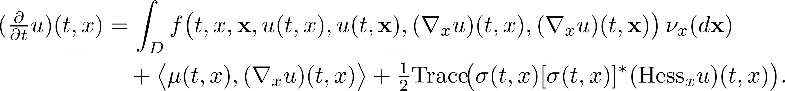

# HighDimPDE.jl

This package provides the Deep Splitting and the MLP algorithms to solve for high dimensional, non-local, nonlinear PDEs (papers in prep.). 
It builds upon DiffEqBase.jl and SciMLBase.jl for the interface, and uses Flux.jl for the solving part (Deep Splitting Algorithm).
It aims at solving PDEs for which the solution u satisfies

<div style="overflow-x: scroll;" align=center>                          

</div>

The scheme is particularly performant when the domain D is highly dimensional, as it overcomes the so called *curse of dimensionality*.

## Installation
Open Julia in your favorite REPL and type the following

```julia
using Pkg;
Pkg.add("https://github.com/vboussange/HighDimPDE.jl.git")
```

This will download latest version from git repo and download all dependencies.

## Getting started
### MLP algorithm
#### Local PDE
Let's solve for the multi dimensional [Fisher KPP](https://en.wikipedia.org/wiki/Fisher%27s_equation) PDE with the MLP algorithm.
```julia
using HighDimPDE

d = 10 # dimension of the problem
tspan = (0.0,0.5) # time horizon
x0 = fill(0.,d)  # initial point
g(X) = exp(- sum(X.^2) ) # initial condition
μ(X,p,t) = 0.0 # advection coefficients
σ(X,p,t) = 0.1 # diffusion coefficients

f(y, z, v_y, v_z, ∇v_y, ∇v_z, t) = max(0.0, v_y) * (1 -  max(0.0, v_y)) # nonlocal nonlinear part of the

prob = PIDEProblem(g, f, μ, σ, x0, tspan) # defining the problem

################################
############ MLP ###############
################################
alg = MLP(M=4, K=10, L=4) # defining the algorithm. We use the Multi Level Picard algorithm
################################
################################
################################

# solving with multiple threads 
sol = solve(prob, alg, verbose = false, multithreading=true)
```
To plot the time series
```julia
using Plots
plot(sol.t, sol.u)
```
#### Non local PDE with Neumann boundary conditions
Let's include in the previous equation non local competition and let's assume Neumann Boundary conditions, so that the domain consists in the hyper cube [-1/2, 1/2]^d.
```julia
using HighDimPDE

d = 10 # dimension of the problem
tspan = (0.0,0.5) # time horizon
x0 = fill(0.,d)  # initial point
g(X) = exp(- sum(X.^2) ) # initial condition
μ(X,p,t) = 0.0 # advection coefficients
σ(X,p,t) = 0.1 # diffusion coefficients

u_domain = [-1/2, 1/2]

f(y, z, v_y, v_z, ∇v_y, ∇v_z, t) = max(0.0, v_y) * (1 -  max(0.0, v_z)) 

prob = PIDEProblem(g, f, μ, 
                    σ, x0, tspan, 
                    u_domain = u_domain) # defining u_domain is sufficient to implement Neumann boundary conditions

################################
############ MLP ###############
################################
alg = MLP(M=4, K=10, L=4, mc_sample = UniformSampling(u_domain[1], u_domain[2]) ) 
################################
################################
################################

sol = solve(prob, alg, verbose = false, multithreading=true)
```

### Deep splitting algorithm
Let's solve the previous equation with the DeepSplitting algorithm.
```julia
using HighDimPDE

d = 10 # dimension of the problem
tspan = (0.0,0.5) # time horizon
x0 = fill(0.,d)  # initial point
g(X) = exp.(- sum(X.^2,dims=1) ) # initial condition
μ(X,p,t) = 0.0 # advection coefficients
σ(X,p,t) = 0.1 # diffusion coefficients

u_domain = [-1/2, 1/2]

f(y, z, v_y, v_z, ∇v_y, ∇v_z, t) = max.(0f0, v_y) .* (1f0 .-  max.(0f0, v_z)) 

prob = PIDEProblem(g, f, μ, 
                    σ, x0, tspan, 
                    u_domain = u_domain)

################################
######## Deep Splitting ########
################################
using Flux # needed to define the neural network

hls = d + 50 #hidden layer size

nn = Flux.Chain(Dense(d,hls,tanh),
        Dense(hls,hls,tanh),
        Dense(hls,1)) # neural network used by the scheme

opt = Flux.Optimiser(ExpDecay(0.1,
                0.1,
                2000,
                1e-4),
                ADAM() )#optimiser
alg = DeepSplitting(nn, K=5, 
                    opt = opt,
                    mc_sample = UniformSampling(u_domain[1], u_domain[2]))
################################
################################
################################

sol = solve(prob, 
            alg, 
            dt=0.1, 
            verbose = true, 
            abstol = 2e-3,
            maxiters = 1000,
            batch_size = 1000,
            use_cuda = false)
```
### Solving on the GPU
`HighDimPDE.jl` allows to run the `DeepSplitting` algorithm on the GPU for (much) improved performance. To do so, just define `x0` as a `CUDA` array and tell the solver `use_cuda = true`.

```julia
using CUDA
x0 = CUDA.fill(0.,d)
```
```julia
sol = solve(prob, 
            alg, 
            dt=dt, 
            verbose = true, 
            abstol = 2e-3,
            maxiters = 1000,
            batch_size = 1000,
            use_cuda = true)
```
That's all!


# Acknowledgements
Sebastian Becker, who wrote the original scripts in Python, TensorFlow and C++, and Arnulf Jentzen for the theoretical developments.
