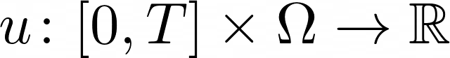

[](https://vboussange.github.io/HighDimPDE.jl/stable)
[](https://vboussange.github.io/HighDimPDE.jl/dev)

# HighDimPDE.jl

**HighDimPDE.jl** is a Julia package to **solve Highly Dimensional non-linear, non-local PDEs** of the form

<div style="overflow-x: scroll;" align=center>                          

</div>
<p>subject to initial and boundary conditions, where .</p>

**HighDimPDE.jl** implements schemes that break down the curse of dimensionality, including

* the Deep BSDE scheme

* the Deep Splitting scheme

* the Multi-Level Picard iterations scheme.

**HighDimPDE.jl** 
* is user friendly, and in particular it is grid-free! ➡️ no mesh required,

* can run both on CPUs and GPUs with no extra fuss. `use_cuda = true`

**HighDimPDE.jl** builds upon [DiffEqBase.jl](https://github.com/SciML/DiffEqBase.jl) and [SciMLBase.jl](https://github.com/SciML/SciMLBase.jl) for the interface, and uses [Flux.jl](https://github.com/FluxML/Flux.jl) for the machine learning part in the case of the `DeepSplitting` algorithm.

## Installation
Open Julia REPL and type the following

```julia
using Pkg;
Pkg.add("https://github.com/vboussange/HighDimPDE.jl.git")
```

This will download latest version from git repo and download all dependencies.

## Getting started
### `MLP`
#### Local PDE
Let's solve the [Fisher KPP](https://en.wikipedia.org/wiki/Fisher%27s_equation) PDE in dimension 10 with the `MLP` algorithm, short for Multi-Level Picard iteration algorithm (see documentation - in preparation - and section [Related papers](#related-papers)).
```julia
using HighDimPDE

## Definition of the problem
d = 10 # dimension of the problem
tspan = (0.0,0.5) # time horizon
x0 = fill(0.,d)  # initial point
g(x) = exp(- sum(x.^2) ) # initial condition
μ(x, p, t) = 0.0 # advection coefficients
σ(x, p, t) = 0.1 # diffusion coefficients
f(x, y, v_x, v_y, ∇v_x, ∇v_y, t) = max(0.0, v_x) * (1 -  max(0.0, v_x)) # nonlocal nonlinear part of the
prob = PIDEProblem(g, f, μ, σ, x0, tspan) # defining the problem

## Definition of the algorithm
alg = MLP() # defining the algorithm. We use the Multi Level Picard algorithm

## Solving with multiple threads 
sol = solve(prob, alg, multithreading=true)
```
To plot the time series
```julia
using Plots
plot(sol.t, sol.u)
```
#### Non local PDE with Neumann boundary conditions
Let's include in the previous equation non local competition and let's assume Neumann Boundary conditions, so that the domain consists in the hyper cube [-1/2, 1/2]^d.
```julia
using HighDimPDE

## Definition of the problem
d = 10 # dimension of the problem
tspan = (0.0,0.5) # time horizon
x0 = fill(0.,d)  # initial point
g(x) = exp( -sum(x.^2) ) # initial condition
μ(x, p, t) = 0.0 # advection coefficients
σ(x, p, t) = 0.1 # diffusion coefficients
u_domain = [-1/2, 1/2]
f(x, y, v_x, v_y, ∇v_x, ∇v_y, t) = max(0.0, v_x) * (1 -  max(0.0, v_y)) 
prob = PIDEProblem(g, f, μ, 
                    σ, x0, tspan, 
                    u_domain = u_domain) # defining u_domain is sufficient to implement Neumann boundary conditions

## Definition of the algorithm
alg = MLP(mc_sample = UniformSampling(u_domain[1], u_domain[2]) ) 

sol = solve(prob, alg, multithreading=true)
```

### `DeepSplitting`
Let's solve the previous equation with the `DeepSplitting` algorithm (see documentation - in preparation - and section [Related papers](#related-papers)).
```julia
using HighDimPDE

## Definition of the problem
d = 10 # dimension of the problem
tspan = (0.0, 0.5) # time horizon
x0 = fill(0.,d)  # initial point
g(x) = exp.(- sum(x.^2, dims=1) ) # initial condition
μ(x, p, t) = 0.0 # advection coefficients
σ(x, p, t) = 0.1 # diffusion coefficients
u_domain = [-1/2, 1/2]
f(x, y, v_x, v_y, ∇v_x, ∇v_y, t) = max.(0f0, v_x) .* (1f0 .-  max.(0f0, v_y)) 
prob = PIDEProblem(g, f, μ, 
                    σ, x0, tspan, 
                    u_domain = u_domain)

## Definition of the neural network to use
using Flux # needed to define the neural network

hls = d + 50 #hidden layer size

nn = Flux.Chain(Dense(d, hls, tanh),
        Dense(hls, hls, tanh),
        Dense(hls, 1)) # neural network used by the scheme

opt = Flux.Optimiser(ExpDecay(0.1,
                0.1,
                200,
                1e-4),
                ADAM() )#optimiser

## Definition of the algorithm
alg = DeepSplitting(nn,
                    opt = opt,
                    mc_sample = UniformSampling(u_domain[1], u_domain[2]))

sol = solve(prob, 
            alg, 
            dt=0.1, 
            verbose = true, 
            abstol = 2e-3,
            maxiters = 1000,
            batch_size = 1000)
```
### Solving on the GPU
`HighDimPDE.jl` allows to run the `DeepSplitting` algorithm on the GPU for (much) improved performance. To do so, just set `use_cuda = true`.

```julia
sol = solve(prob, 
            alg, 
            dt=0.1, 
            verbose = true, 
            abstol = 2e-3,
            maxiters = 1000,
            batch_size = 1000,
            use_cuda=true)
```

That's all!

# Related papers
- [`MLP`: Numerical simulations for full history recursive multilevel Picard approximations for systems of high-dimensional partial differential equations](https://arxiv.org/abs/2005.10206)
- [`DeepSplitting`: Deep Splitting method for parabolic PDEs](https://arxiv.org/abs/1907.03452)
- [`DeepBSDE`: Solving high-dimensional partial differential equations using deep learning](https://www.pnas.org/content/115/34/8505)

# Acknowledgements
`HighDimPDE.jl` is inspired from Sebastian Becker's scripts in Python, TensorFlow and C++, and Pr. Arnulf Jentzen largely contributed to the theoretical developments of the schemes implemented.
